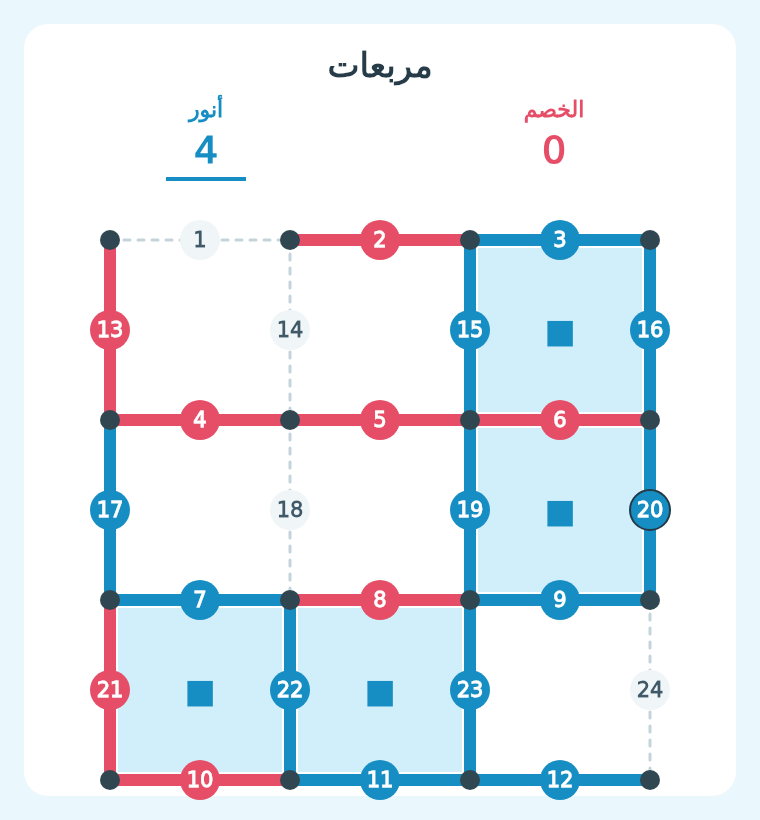

# مربعات — 2.5.48

## بدء التحدي

في شات البنك اكتب `مربعات @العضو 1000`، مع منشن حقيقي للخصم. يعمل أيضًا `!مربعات` و`-مربعات` بنفس المعاملات، أو `/مربعات` بخياري العضو والمبلغ. تقبل الأرقام العربية والإنجليزية.

تظهر دعوة قبول أو رفض للخصم. بعد القبول يُحجز المبلغ من الطرفين ويبدأ صاحب الدعوة باللون الأزرق؛ خصمه بالأحمر. أُضيف زر مربعات إلى قائمة الألعاب، وموعد التحدي التالي إلى أمر وقت.

## القواعد

- اللوحة 4×4 نقاط، أي 9 مربعات و24 خطًا أفقيًا أو عموديًا.
- اختر زر رقم الخط المطابق لمكانه بين النقطتين في الصورة. الأزرار تحت الصورة؛ صورة Discord نفسها ليست سطحًا قابلًا للنقر.
- كل حركة ترسم خطًا واحدًا. الخط المرسوم يصبح معطّلًا ولا يمكن تكراره.
- صاحب الضلع الرابع يستحوذ على المربع بصرف النظر عن ألوان الأضلاع الثلاثة السابقة.
- إكمال مربع يمنح اللاعب دورًا إضافيًا؛ الخط المشترك قد يكمل مربعين ويمنحهما للاعب نفسه.
- تتلوّن المربعات بلون اللاعب الذي استحوذ عليها، وتظهر نتيجة الطرفين والدور الحالي.
- تستمر اللعبة حتى تُرسم جميع الخطوط؛ يفوز صاحب أكبر عدد من المربعات.
- اللوحة الحالية تحتوي تسعة مربعات، لذا تكون نتيجة اللعبة المكتملة حاسمة.

## المبلغ والمهل

المبلغ عدد صحيح من 1 إلى 1,000,000,000، ويجب أن يملكه الطرفان. الفائز يسترجع مبلغه ويأخذ مبلغ خصمه كاملًا دون ضريبة.

قبول الدعوة خلال 30 ثانية. لكل حركة 30 ثانية، وتتجدد المهلة عند كل حركة صحيحة بما فيها الدور الإضافي. انتهاء مهلة دور ظاهر للاعب يعني خسارته. فشل توصيل لوحة اللعب لا يُعامل كخسارة تأخير؛ تُعاد المبالغ عند إلغاء الجولة.

انتظار إرسال تحدي مربعات جديد 20 دقيقة من القبول على صاحب الدعوة فقط؛ استقبال التحديات متاح أثناء الانتظار. الانتظار مستقل عن بقية الألعاب.

## التحديث والتشغيل

حدّث المشروع كاملًا ثم أعد نشر خدمة Render بإعداداتها وقاعدة بياناتها الحالية. احتفظ بمجلد `assets` وملفات `package.json` و`package-lock.json`. أمر البناء الحالي `npm ci --omit=dev` وأمر التشغيل `npm start`.

تسجّل بداية التشغيل أمر `/مربعات` تلقائيًا، وتسترجع حالة الجولات وعمليات الرصيد المحفوظة. يستخدم التحديث المكتبات الموجودة ولا يحتاج متغيرات إعداد جديدة.

## صورة أثناء اللعب

## التحقق

نجحت اختبارات الألعاب البالغ عددها 203. الفحص الكامل نجح في 971 من 978؛ السبع المتبقية مطابقة لمشكلات اختبارات النهب في الملف الأصلي، ولا توجد حالات فشل إضافية. راجع `VERIFICATION.md` والسجلات المرفقة. لم يُختبر البوت على سيرفر Discord فعلي.
